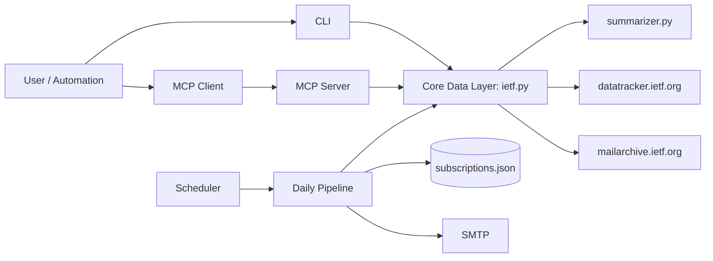

# ARCHITECTURE.md

## System Overview
`ietf-wg-agent` is a Python application with 3 entrypoints:
- CLI app: `ietf-wg-agent`
- MCP server: `ietf-wg-mcp`
- Daily runner: `ietf-wg-daily`
- Maintainer tool: `ietf-wg-maintainer`

Additional scheduler entrypoints:
- `ietf-wg-daily-updates` (one-shot discussion-update run)
- `ietf-wg-daily-updates-scheduler` (looping scheduler)

## Python Compatibility
- Base application: Python 3.9+
- MCP support: Python 3.10+
- Bootstrap tooling (`scripts/bootstrap.py`) provides a seamless MCP path:
  - detects when MCP is requested on Python 3.9,
  - auto-selects a Python 3.10+ interpreter when available,
  - auto-creates `.venv-mcp` by default to avoid clobbering a 3.9 venv.

## Core Modules
- `src/ietf_wg_agent/ietf.py`: IETF data fetch/parsing (WG lookup, charter, drafts, discussions).
  - Includes maintainer vector DB lifecycle (`rebuild_wg_charter_db`, `get_db_metadata`).
  - Includes technology matching API (`suggest_wgs_by_technology`) over local charter vector DB.
  - Includes meetings update parsing (agenda + minutes for last 2 meetings).
  - Includes upcoming IETF agenda discovery (next meeting + WG agenda summary).
  - Includes last completed IETF meeting summary (WG minutes).
- `src/ietf_wg_agent/maintainer.py`: maintainer-only command surface for DB rebuild/metadata and garbage-collector checks.
- `src/ietf_wg_agent/summarizer.py`: text summarization for charters and discussion threads.
- `src/ietf_wg_agent/cli.py`: interactive user flow.
- `src/ietf_wg_agent/server.py`: MCP tool registration and orchestration.
- `src/ietf_wg_agent/daily.py`: periodic report/email workflow.
- `src/ietf_wg_agent/discussion_scheduler.py`: recurring scheduler for daily discussion updates.
- `src/ietf_wg_agent/notifier.py`: SMTP delivery with retry/backoff/jitter.
- `src/ietf_wg_agent/subscriptions.py`: local subscription persistence.

## High-Level Flow

## Requirement Coverage Snapshot (As-Coded)

Implemented:
- WG resolution/suggestions.
- Charter retrieval (with summarized presentation in current CLI/MCP path).
- Active drafts parsing with status/abstract.
- Discussion summaries (3 months and last day).
- Upcoming and last IETF meeting summaries.
- Daily email delivery with skip-if-no-update behavior.

Tracked gaps:
- User-facing technology-onboarding flow integration across CLI/MCP/Webex.
- Draft tracker.
- Webex delivery surface parity.
- Full charter output mode (non-summary path).
- Meeting update summaries for agenda/minutes content.

## Skills Layer
- Repository-level skill registry: `SKILLS.md`
- Per-feature skill docs: `skills/*/SKILL.md`
- Skill docs define purpose, inputs, steps, outputs, failure handling, and linked tests.
- Skill correctness is validated by `tests/test_skills_docs.py`.

## External Dependencies
- Datatracker API/pages: `https://datatracker.ietf.org`
- IETF mailarchive: `https://mailarchive.ietf.org`
- SMTP server (configurable)

## Data Stores
- Subscription DB: `~/.ietf_wg_agent_subscriptions.json`
- Reports: `reports/daily-YYYY-MM-DD.txt`
- Maintainer vector DB: `data/wg_charter_vector_db.json`
  - Built from WG `/about/` charter text + `/documents/` page text.
  - Rebuilt via `ietf-wg-maintainer rebuild-database`.

## Reliability Strategy
- API-first parsing with HTML fallbacks.
- Defensive parsers for multiple page layouts.
- Test suite covers CLI flows, suggestions, drafts/status/abstract parsing, and discussion summaries.

## API Contract Reference
- Requirement-named API status matrix:
  - `docs/design-docs/internal-api-contract.md`
