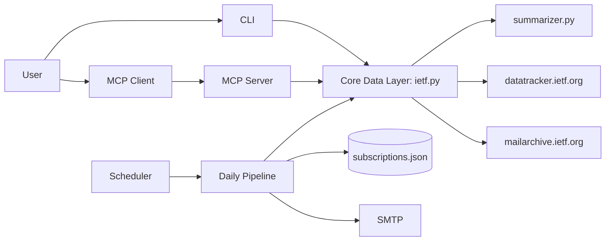

# ARCHITECTURE.md

## System Overview
`ietf-wg-agent` is a Python application with 4 user-facing entrypoints and 2 scheduler helpers:
- CLI app: `ietf-wg-agent`
- MCP server: `ietf-wg-mcp`
- Daily runner: `ietf-wg-daily`
- Maintainer tool: `ietf-wg-maintainer`
- Daily discussion one-shot: `ietf-wg-daily-updates`
- Daily discussion scheduler: `ietf-wg-daily-updates-scheduler`

## Runtime Compatibility
- Base runtime: Python 3.9+
- MCP runtime: Python 3.10+

## Core Modules
- `src/ietf_wg_agent/ietf.py`
  - WG discovery/resolution/suggestions
  - charter + documents corpus parsing
  - vector DB lifecycle and technology matching
  - drafts/discussions/meetings retrieval
  - requirement-named internal API wrappers (`REQ-API-001..006`)
- `src/ietf_wg_agent/cli.py`
  - interactive iterative onboarding for `REQ-FEAT-001..006`
- `src/ietf_wg_agent/server.py`
  - MCP tools mirroring core features
- `src/ietf_wg_agent/summarizer.py`
  - deterministic summaries for discussion/meeting outputs
- `src/ietf_wg_agent/daily.py`, `discussion_scheduler.py`, `notifier.py`, `subscriptions.py`
  - scheduled fetch/report/email pipeline
- `src/ietf_wg_agent/maintainer.py`
  - DB rebuild, DB metadata, garbage-collector checks

## High-Level Flow

## Requirement Coverage Snapshot (Current Code)
Completed for onboarding slice:
- `REQ-FEAT-001`: technology onboarding prompt and vector matching.
- `REQ-FEAT-002`: WG name resolution (short/full forms + suggestions).
- `REQ-FEAT-003`: complete charter retrieval (non-truncated output in CLI and MCP).
- `REQ-FEAT-004`: active drafts output in onboarding flow (limited to latest 10 for performance).
- `REQ-FEAT-005`: WG draft-discussion summary for last 3 months.
- `REQ-FEAT-006`: updates from last 2 IETF meetings with agenda/minutes links.

Notes on reliability:
- Discussion parser now uses metadata-focused date extraction to avoid false positives from subject text deadlines (for example `Ends YYYY-MM-DD`).

Open gaps outside `REQ-FEAT-001..006`:
- Webex delivery mode parity (`REQ-MODE-001`).
- Draft tracker user-facing route (`REQ-FEAT-010`) though API wrapper exists.

## Data Stores
- Subscription DB: `~/.ietf_wg_agent_subscriptions.json`
- Reports: `reports/daily-YYYY-MM-DD.txt`
- Maintainer vector DB: `data/wg_charter_vector_db.json`

## Diagrams
- REQ-FEAT-001..006 architecture (PlantUML source + SVG):
  - `docs/design-docs/diagrams/req-feat-001-006-architecture.puml`
  - `docs/design-docs/diagrams/req-feat-001-006-architecture.svg`
- REQ-FEAT-001..006 per-feature flow diagrams (PlantUML + SVG):
  - `docs/design-docs/diagrams/req-feat-001-flow.puml` / `.svg`
  - `docs/design-docs/diagrams/req-feat-002-flow.puml` / `.svg`
  - `docs/design-docs/diagrams/req-feat-003-flow.puml` / `.svg`
  - `docs/design-docs/diagrams/req-feat-004-flow.puml` / `.svg`
  - `docs/design-docs/diagrams/req-feat-005-flow.puml` / `.svg`
  - `docs/design-docs/diagrams/req-feat-006-flow.puml` / `.svg`

## API Contract Reference
- `docs/design-docs/internal-api-contract.md`
