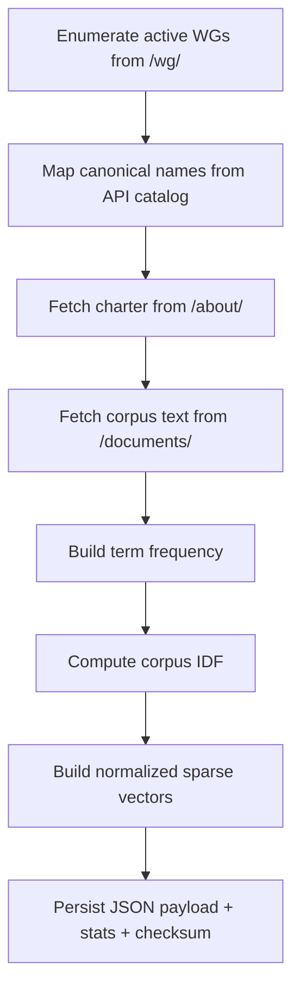
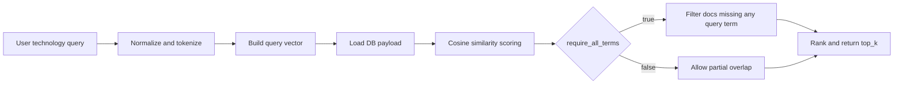

# IETF Data Module (`src/ietf_wg_agent/ietf.py`)

## Purpose
Centralized integration layer for IETF data retrieval, parsing, normalization, and requirement-named internal APIs.

## Main Sections
- WG catalog + resolution + suggestions
- WG charter vector DB lifecycle (rebuild + metadata + technology matching)
- WG `/documents/` corpus ingestion for technology matching
- Charter extraction
- Draft extraction and enrichment (title/status/abstract)
- Discussion extraction from mailarchive
- Last-two-meeting updates parsing
- Upcoming IETF meeting agenda summary
- Last completed IETF meeting summary

## Key Constants and Data Paths
- WG index: `https://datatracker.ietf.org/wg/`
- WG about page: `https://datatracker.ietf.org/wg/{acronym}/about/`
- WG documents page: `https://datatracker.ietf.org/wg/{acronym}/documents/`
- IETF important dates: `https://datatracker.ietf.org/meeting/important-dates/`
- Meeting agenda text: `https://datatracker.ietf.org/meeting/{number}/agenda.txt`
- Local vector DB: `data/wg_charter_vector_db.json`

## Contract-Named APIs (Current)

Implemented:
- `rebuild_wg_charter_db(force_delete_old=True) -> RebuildResult`
- `get_db_metadata() -> DbMetadata`
- `resolve_wg_name(user_input) -> WgResolutionResult`
- `suggest_wgs_by_technology(query, top_k=10, require_all_terms=True) -> list[WgMatch]`
- `get_wg_charter(wg_id) -> CharterResult`
- `get_wg_active_drafts(wg_id, limit=5) -> list[DraftResult]`
- `get_wg_discussion_summary(wg_id, window_days=90) -> DiscussionSummary`
- `get_wg_last_two_meeting_updates(wg_id) -> MeetingUpdates`
- `get_upcoming_ietf_agenda_summary() -> UpcomingMeetingSummary`
- `get_last_ietf_meeting_summary() -> LastMeetingSummary`
- `track_draft_or_rfc(identifier, include_vendor_signals=False) -> DraftTrackerResult`
- `run_daily_wg_update(wg_id, notify=True) -> DailyUpdateResult`
- `schedule_daily_updates(subscription) -> SchedulerResult`

Current CLI usage notes:
- REQ-FEAT-004 path uses `get_wg_active_drafts(..., limit=10)` for performance.
- REQ-FEAT-005 path uses `get_wg_discussion_summary(..., window_days=90)` and
  labels period as `last 3 months`.
- REQ-FEAT-003 path uses `get_wg_charter(...)` and returns full charter text.
- REQ-FEAT-006 path uses `get_wg_last_two_meeting_updates(...)` and filters
  meetings to labels matching `IETF <number>`.
- REQ-FEAT-008 path uses `get_upcoming_ietf_agenda_summary()` and:
  - parses upcoming events from `important-dates`,
  - extracts required milestone details per upcoming event,
  - emits agenda link per IETF event (`meeting/<number>/agenda.txt`),
  - does not emit full WG agenda-body output in this feature response.
  - if `agenda.txt` is still boilerplate and today's date is before the
    final-agenda publish milestone, appends an explicit not-yet-published notice.
  - treats `Preliminary Agenda published` as equivalent milestone evidence for
    `Final agenda to be published`.

Detailed matrix and status: `docs/design-docs/internal-api-contract.md`

## Vector DB Design
Per WG indexed corpus is built from:
1. WG acronym
2. canonical WG name
3. complete charter text from `/about/`
4. complete documents-page text from `/documents/`

Rationale:
- Charter text captures WG scope.
- Documents text captures real draft-centric technology terms that charters may omit.

## Rebuild Flow

## Technology Matching Flow

## Reliability Features
- API-first and HTML parsing fallback patterns.
- Defensive parsing for variant Datatracker layouts.
- Explicit `DatatrackerError` surfaces for caller-level handling.
- Network timeout policy: default web timeout is 120 seconds (`HTTP_TIMEOUT_SECONDS`).
- URL-specific fetch errors: raised messages include the exact unreachable URL.
- Rebuild tolerates per-WG failures and records them under payload `errors`/`warnings`.
- Mailarchive date fallback parsing is metadata-focused to avoid false positives from
  subject deadlines such as `(Ends YYYY-MM-DD)`.
- Meeting update extraction is constrained to `IETF <number>` meetings and sorted
  by meeting number descending before applying the `limit`.

## Output Data Contracts
- `RebuildResult`: rebuild summary fields (path, timestamp, counts, checksum).
- `DbMetadata`: DB presence + metadata.
- `WgResolutionResult`: matched WG or suggestions.
- `WgMatch`: acronym, name, score, justification.

## Tests Covering This Module
- `tests/test_ietf_vector_db.py`
- `tests/test_ietf_drafts.py`
- `tests/test_ietf_discussions.py`
- `tests/test_ietf_meetings.py`
- `tests/test_ietf_upcoming_agenda.py`
- `tests/test_ietf_last_meeting.py`
- `tests/test_ietf_suggestions.py`
