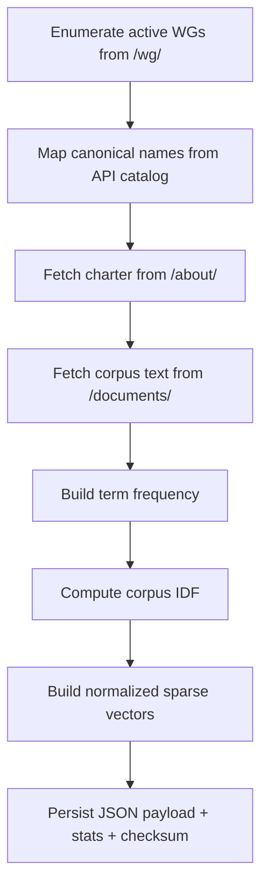
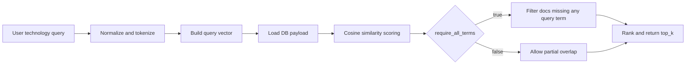

# IETF Data Module (`src/ietf_wg_agent/ietf.py`)

## Purpose
Centralized integration layer for IETF data retrieval, parsing, normalization, and requirement-named internal APIs.

## Main Sections
- WG catalog + resolution + suggestions
- WG charter vector DB lifecycle (rebuild + metadata + technology matching)
- WG `/documents/` corpus ingestion for technology matching
- Charter extraction
- Draft extraction and enrichment (title/status/abstract)
- Discussion extraction from mailarchive
- Last-two-meeting updates parsing
- Upcoming IETF meeting agenda summary
- Last completed IETF meeting summary

## Key Constants and Data Paths
- WG index: `https://datatracker.ietf.org/wg/`
- WG about page: `https://datatracker.ietf.org/wg/{acronym}/about/`
- WG documents page: `https://datatracker.ietf.org/wg/{acronym}/documents/`
- Local vector DB: `data/wg_charter_vector_db.json`

## Contract-Named APIs (Current)

Implemented:
- `rebuild_wg_charter_db(force_delete_old=True) -> RebuildResult`
- `get_db_metadata() -> DbMetadata`
- `resolve_wg_name(user_input) -> WgResolutionResult`
- `suggest_wgs_by_technology(query, top_k=10, require_all_terms=True) -> list[WgMatch]`

Pending wrappers (required names not yet implemented):
- `get_wg_charter`
- `get_wg_active_drafts`
- `get_wg_discussion_summary`
- `get_wg_last_two_meeting_updates`
- `get_upcoming_ietf_agenda_summary`
- `get_last_ietf_meeting_summary`
- `track_draft_or_rfc`
- `run_daily_wg_update`
- `schedule_daily_updates`

Detailed matrix and status: `docs/design-docs/internal-api-contract.md`

## Vector DB Design
Per WG indexed corpus is built from:
1. WG acronym
2. canonical WG name
3. complete charter text from `/about/`
4. complete documents-page text from `/documents/`

Rationale:
- Charter text captures WG scope.
- Documents text captures real draft-centric technology terms that charters may omit.

## Rebuild Flow

## Technology Matching Flow

## Reliability Features
- API-first and HTML parsing fallback patterns.
- Defensive parsing for variant Datatracker layouts.
- Explicit `DatatrackerError` surfaces for caller-level handling.
- Rebuild tolerates per-WG failures and records them under payload `errors`/`warnings`.

## Output Data Contracts
- `RebuildResult`: rebuild summary fields (path, timestamp, counts, checksum).
- `DbMetadata`: DB presence + metadata.
- `WgResolutionResult`: matched WG or suggestions.
- `WgMatch`: acronym, name, score, justification.

## Tests Covering This Module
- `tests/test_ietf_vector_db.py`
- `tests/test_ietf_drafts.py`
- `tests/test_ietf_discussions.py`
- `tests/test_ietf_meetings.py`
- `tests/test_ietf_upcoming_agenda.py`
- `tests/test_ietf_last_meeting.py`
- `tests/test_ietf_suggestions.py`
