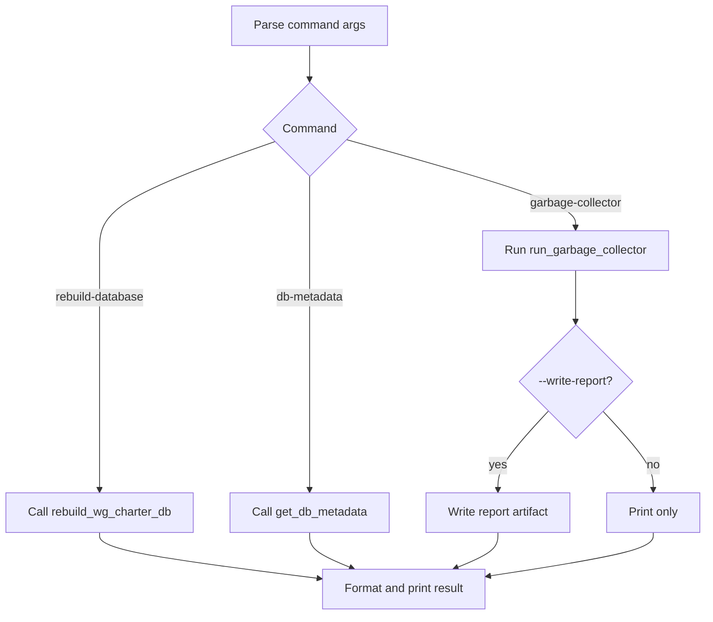

# Maintainer Module (`src/ietf_wg_agent/maintainer.py`)

## Purpose
Provide maintainer-only operations for:
- local WG charter vector DB lifecycle,
- metadata inspection,
- repository entropy control via deterministic garbage-collector checks.

## Entry Point
- Console script: `ietf-wg-maintainer`
- Python module mode: `PYTHONPATH=src python3 -m ietf_wg_agent.maintainer <command>`

## Commands

### `rebuild-database`
Contract:
- Calls `rebuild_wg_charter_db(force_delete_old=not --keep-old)`.
- Default mode deletes previous DB before writing a new one.

Output fields:
- DB path
- build timestamp
- WG entries count
- term count
- skipped WG count
- whether previous file was deleted
- checksum

### `db-metadata`
Contract:
- Calls `get_db_metadata()`.
- Reports schema/stats/checksum without rebuilding.

### `garbage-collector [--write-report]`
Contract:
- Runs deterministic hygiene checks and prints categorized report.
- With `--write-report`, persists report under `reports/garbage-collector-YYYY-MM-DD.txt`.

Current checks:
1. Required artifact existence (root docs/plan files).
2. Module design-doc to source-file mapping integrity.
3. Skill registry path validity (`SKILLS.md` linked files).
4. Required internal API contract function names in `ietf.py`.

## Control Flow

## Failure Handling
- Rebuild/metadata failures from network or invalid payload are surfaced as explicit `DatatrackerError` output with non-zero exit status.
- Garbage collector does not crash on inconsistencies; it returns a structured FAIL report with issue lists.

## Requirement Mapping
- `REQ-MAINT-004`: persisted vector DB in repo.
- `REQ-MAINT-005`: explicit rebuild option and safe delete-old behavior.
- `REQ-MAINT-006`: API contract visibility via command outputs/docs.
- `REQ-MAINT-007`: garbage collector command for inconsistency detection.

## Known Limitations
- Garbage collector currently verifies presence and naming contracts, not full semantic architecture rules.
- API contract checks intentionally report `REQ-API-003..006` missing functions until wrappers are implemented.
