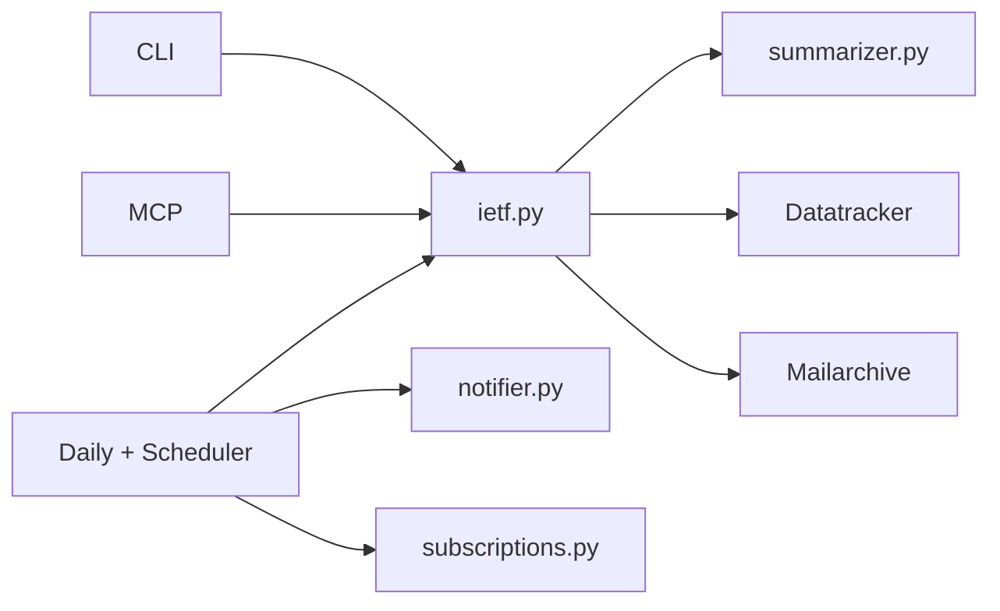

# New Engineer Quickstart Flow

## Purpose
Provide a compact entrypoint for developer onboarding and point to the full onboarding source.

## Primary Onboarding Source

Use this as canonical guide:
- `docs/product-specs/new-user-onboarding.md`

This document is the short version and should remain aligned with that guide.

## Read Order (Day 0)

1. `requirements.txt`
2. `docs/product-specs/new-user-onboarding.md`
3. `ARCHITECTURE.md`
4. `docs/DESIGN.md`
5. `docs/design-docs/index.md`
6. `docs/exec-plans/active/2026-02-28-requirements-parity-phase-1.md`
7. `docs/exec-plans/tech-debt-tracker.md`

## First Local Run

1. Install with `./scripts/setup.sh` (or platform equivalent).
2. Activate virtual environment.
3. Run CLI: `ietf-wg-agent`.
4. Run tests: `python -m pytest -q tests`.

## Architecture-at-a-Glance

## Contribution Flow

1. Pick requirement-linked task from active plan/tech debt.
2. Add parser + orchestration changes.
3. Add tests (CLI-path + parser/unit).
4. Run full tests.
5. Update docs and execution-plan files.
6. Submit PR with requirement IDs and risk notes.
