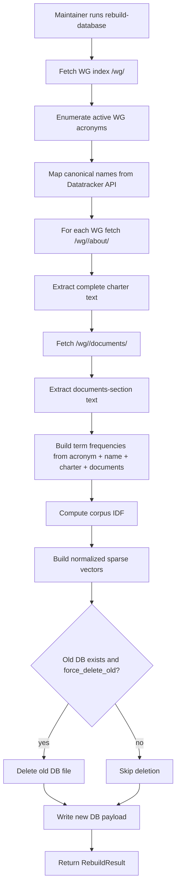
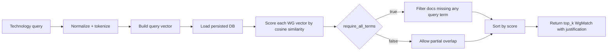
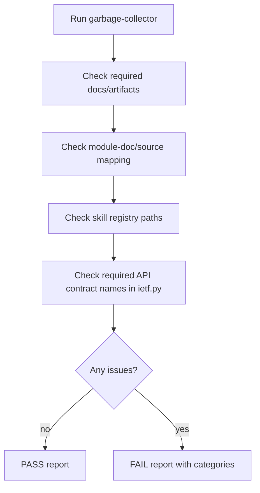

# Vector DB Implementation Walkthrough

Date: 2026-02-28  
Scope: REQ-MAINT-001..007 + REQ-API-001/002 baseline + corpus quality fix (`/documents/` ingestion)

## Process Note
This document explains implementation reasoning, decisions, and execution steps.
It does not include private internal reasoning traces.

## 1. Requirement Breakdown and Delivery Status

| Requirement | What it requires | Delivery status | Implementation notes |
|---|---|---|---|
| REQ-MAINT-001 | Crawl WG index and enumerate active WGs | Delivered | `crawl_active_working_groups` parses `https://datatracker.ietf.org/wg/` and filters concluded/terminated rows. |
| REQ-MAINT-002 | Fetch WG about page | Delivered | Rebuild loop fetches `https://datatracker.ietf.org/wg/<wg>/about/`. |
| REQ-MAINT-003 | Extract complete charter text | Delivered | `fetch_charter_text` extracts complete charter section under heading. |
| REQ-MAINT-004 | Build/persist vector DB in repo | Delivered | DB persisted at `data/wg_charter_vector_db.json`. |
| REQ-MAINT-005 | Rebuild option with delete-old semantics | Delivered | `rebuild_wg_charter_db(force_delete_old=True)` + maintainer command `rebuild-database`. |
| REQ-MAINT-006 | Document vector DB API and usage | Delivered (baseline) | API docs added in module docs + internal API contract doc. |
| REQ-MAINT-007 | Garbage collector for inconsistencies | Delivered (baseline) | `ietf-wg-maintainer garbage-collector` with deterministic checks. |

Additional corpus-quality requirement (from maintainer feedback):
- Include WG `/documents/` section text in index corpus.
- Status: Delivered (`fetch_wg_documents_section_text`, stored in DB payload and used in term vectors).

## 2. Engineering Thought Process (Design Rationale)
1. Keep rebuild deterministic and dependency-light.
2. Persist index in-repo JSON for inspectability and zero external DB ops.
3. Prefer safe rerun semantics (`force_delete_old=True` by default).
4. Preserve coverage from WG index crawl but improve name quality using API mapping.
5. Expand corpus beyond charter text because many protocol terms are draft-title-heavy (`vrrp`, `flex-algo`, `bgp-ls`).
6. Build maintenance guardrails (garbage collector) to detect drift in docs/artifacts/API naming.

## 3. Design Considerations and Tradeoffs

| Decision | Why | Tradeoff |
|---|---|---|
| Sparse TF-IDF style vectors | Deterministic, fast, no heavy ML runtime | Less semantic richness than neural embeddings |
| Store full `charter_text` and `documents_text` | Auditable index inputs and easier debugging | Large JSON file size |
| Partial-failure rebuild tolerance | Rebuild remains useful even with some WG failures | Must inspect `errors`/`warnings` for full confidence |
| `require_all_terms=True` default | Better precision for compound queries | Lower recall for underspecified queries |
| GC checks based on contracts and files | Deterministic and stable | Does not yet validate deep semantic architecture constraints |

## 4. Design Flow (Graphical)

### 4.1 Rebuild Pipeline


### 4.2 Query-Matching Pipeline


### 4.3 Garbage Collector Pipeline


## 5. Execution Flow and Command Log

## 5.1 Commands Used
```bash
PYTHONPATH=src python3 -m ietf_wg_agent.maintainer rebuild-database
PYTHONPATH=src python3 -m ietf_wg_agent.maintainer db-metadata
PYTHONPATH=src python3 -m ietf_wg_agent.maintainer garbage-collector
wc -l data/wg_charter_vector_db.json
wc -c data/wg_charter_vector_db.json
PYTHONPATH=src python3 -m pytest -q tests
```

## 5.2 Observed Outputs (Current Snapshot)

Rebuild:
```text
Rebuilt WG charter DB.
- Path: /Users/addogra/Desktop/IETF-Learning-Tools/local-copy/data/wg_charter_vector_db.json
- Built at: 2026-02-28T16:23:55.048935+00:00
- WG entries: 116
- Terms: 10848
- Skipped WGs: 18
- Deleted previous copy: True
- Checksum: 595fc4f9d71a4e32a6f7a6a84369e5fcf530c27d904828f7a1be712c5791ca57
```

Metadata:
```text
WG charter DB metadata
- Path: /Users/addogra/Desktop/IETF-Learning-Tools/local-copy/data/wg_charter_vector_db.json
- Exists: True
- Schema version: 1
- Built at: 2026-02-28T16:23:55.048935+00:00
- WG entries: 116
- Terms: 10848
- Skipped WGs: 18
- Checksum: 595fc4f9d71a4e32a6f7a6a84369e5fcf530c27d904828f7a1be712c5791ca57
```

Garbage collector:
```text
Result: FAIL (inconsistencies found)
API Contract Issues:
- Missing API contract function: get_wg_charter
- Missing API contract function: get_wg_active_drafts
- Missing API contract function: get_wg_discussion_summary
- Missing API contract function: get_wg_last_two_meeting_updates
- Missing API contract function: get_upcoming_ietf_agenda_summary
- Missing API contract function: get_last_ietf_meeting_summary
- Missing API contract function: track_draft_or_rfc
- Missing API contract function: run_daily_wg_update
- Missing API contract function: schedule_daily_updates
```

File size stats:
```text
101859 data/wg_charter_vector_db.json
4348122 data/wg_charter_vector_db.json
```
Derived pagination metric (240 lines/page): `425` pages.

Test run:
```text
45 passed, 1 warning in 0.20s
```

## 6. Change Inventory (With Change Comments)

| File | Change comment |
|---|---|
| `src/ietf_wg_agent/ietf.py` | Added vector DB dataclasses/APIs, WG index crawl, `/documents/` ingestion, rebuild metadata/stats/checksum updates, technology matching. |
| `src/ietf_wg_agent/maintainer.py` | Added maintainer CLI commands and garbage-collector consistency checks. |
| `tests/test_ietf_vector_db.py` | Added lifecycle/matching tests and documents-term coverage test (`vrrp bfd`). |
| `tests/test_maintainer.py` | Added maintainer output and garbage-collector behavior tests. |
| `pyproject.toml` | Added maintainer console script entry point. |
| `setup.py` | Added maintainer console script entry point for packaging parity. |
| `docs/design-docs/modules/ietf-module.md` | Documented API surface, corpus composition, and flow details. |
| `docs/design-docs/modules/maintainer-module.md` | Documented command contracts, checks, and failure model. |
| `docs/generated/db-schema.md` | Updated DB schema reference to include new fields. |
| `README.md` | Added maintainer usage and vector DB references. |
| `ARCHITECTURE.md` | Added maintainer entrypoint and data-store details. |

## 7. Test Cases Added/Updated for This Requirement

| Test file | Test case | What it validates |
|---|---|---|
| `tests/test_ietf_vector_db.py` | `test_rebuild_wg_charter_db_and_metadata` | Rebuild creates DB and metadata is coherent. |
| `tests/test_ietf_vector_db.py` | `test_rebuild_wg_charter_db_deletes_previous_copy` | Rebuild delete-old semantics for idempotent reruns. |
| `tests/test_ietf_vector_db.py` | `test_suggest_wgs_by_technology_and_semantics` | Query matching and strict AND behavior. |
| `tests/test_ietf_vector_db.py` | `test_suggest_wgs_by_technology_raises_when_db_missing` | Error handling when DB is not built. |
| `tests/test_ietf_vector_db.py` | `test_resolve_wg_name_wrapper` | Requirement-named WG resolver wrapper behavior. |
| `tests/test_ietf_vector_db.py` | `test_documents_section_terms_are_included_in_vector_db` | `/documents/` corpus terms improve matching (`vrrp bfd`). |
| `tests/test_maintainer.py` | `test_maintainer_rebuild_command_prints_summary` | Maintainer CLI rebuild output contract. |
| `tests/test_maintainer.py` | `test_run_garbage_collector_reports_missing_api` | GC flags missing API names. |
| `tests/test_maintainer.py` | `test_run_garbage_collector_passes_on_empty_requirements` | GC pass behavior when constraints are satisfied. |

## 8. Known Gaps After This Slice
- Draft tracker user-facing CLI/MCP route is pending (`TD-003`).
- Webex delivery mode parity remains pending (`TD-002`).
- Richer meeting summaries are still pending (`TD-005`).
- Technology-onboarding output UX cleanup (hide score by default) is pending (`TD-011`).

## 9. Related Docs
- `docs/design-docs/internal-api-contract.md`
- `docs/design-docs/modules/ietf-module.md`
- `docs/design-docs/modules/maintainer-module.md`
- `docs/exec-plans/active/2026-02-28-requirements-parity-phase-1.md`
- `docs/exec-plans/tech-debt-tracker.md`
