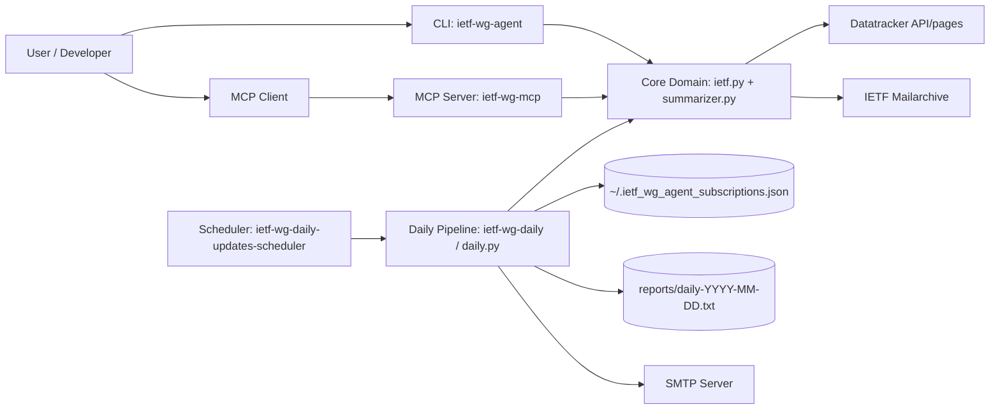
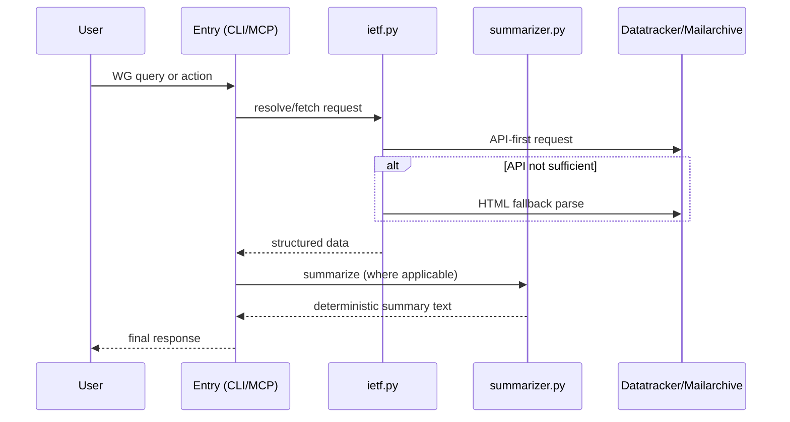
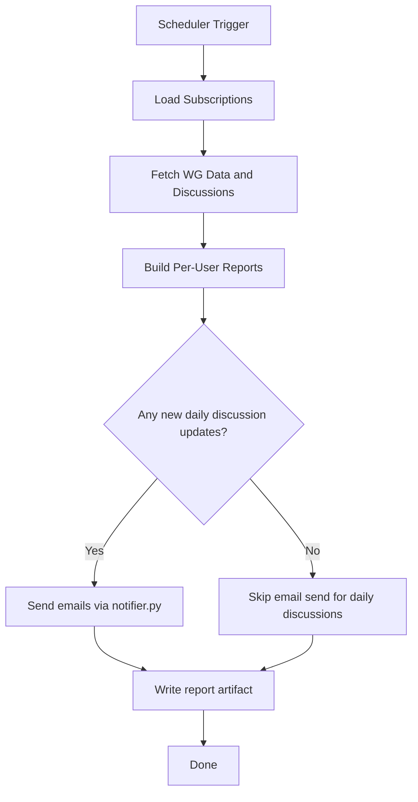

# New Developer Onboarding Guide

Version: 2026-02-28
Scope: Day 0 to first production-ready pull request

## 1. What This Project Is

`ietf-wg-agent` is an IETF Working Group assistant designed to:
- help engineers discover relevant IETF WGs,
- summarize WG charter and activity,
- provide draft/discussion/meeting insights,
- support multiple delivery modes:
  - CLI agent,
  - MCP server,
  - daily scheduled runner,
  - Webex bot (required target, not yet implemented).

Primary requirement source of truth: `requirements.txt`.

## 2. Product Intent (Why It Exists)

The product must serve two user types in one interaction model:
- New-to-IETF users who describe a technology area (example: `OSPF security`).
- Experienced users who already know a WG name/acronym (example: `LSR`).

The long-term intent is parity across all delivery modes and deterministic behavior against IETF sources with graceful fallback logic.

## 3. Current Reality: Coded (Not Runtime-Verified Here)

This section is based on repository code + tests review, not live end-to-end execution in your environment.

### 3.1 Requirements Coverage Snapshot

| Requirement Area | Status | Notes |
|---|---|---|
| WG resolution by acronym/full name (`REQ-FEAT-002`) | Coded | Implemented in `ietf.py`, used in CLI/MCP. |
| WG suggestions for ambiguous input (`REQ-UX-003`) | Coded | Ranked suggestions exist for typos and partial names. |
| WG charter retrieval (`REQ-FEAT-003`) | Partially coded | Charter fetch exists; default UX returns summary, not guaranteed full charter output mode. |
| Active drafts top 5 with status+abstract (`REQ-FEAT-004`) | Coded | API + HTML fallback parsing implemented. |
| Last 3 months discussion summary (`REQ-FEAT-005`) | Coded | Mailarchive parser with bounded pagination. |
| Last 2 WG meetings updates (`REQ-FEAT-006`) | Partially coded | Agenda/minutes links available; summary text enrichment gap remains. |
| Daily updates only when new content exists (`REQ-FEAT-007`, `REQ-REL-003`) | Coded | Discussion-update email skips send when no updates. |
| Upcoming IETF meeting agenda summary (`REQ-FEAT-008`) | Coded | Next meeting metadata + WG agenda summaries implemented. |
| Last completed IETF meeting summary (`REQ-FEAT-009`) | Coded | Meeting detection + WG minutes summaries implemented. |
| Draft tracker (`REQ-FEAT-010`) | Not coded | Explicit gap. |
| Technology onboarding + charter vector DB (`REQ-FEAT-001`, `REQ-VDB-*`, `REQ-MAINT-*`) | Partially coded | Maintainer DB rebuild/metadata/matching APIs are coded; user-facing onboarding route is still pending. |
| Webex delivery mode parity (`REQ-MODE-001`) | Not coded | Explicit gap. |
| Iterative follow-up and always offer Quit (`REQ-INPUT-002`, `REQ-UX-001`) | Partially coded | Current CLI is mostly one-shot menu flow. |
| Internal API contract naming (`REQ-API-001..006`) | Partially coded | REQ-API-001/002 baseline names now exist; remaining contract functions are still pending. |

### 3.2 What Is Implemented in Code Today

Core modules:
- `src/ietf_wg_agent/ietf.py`
  - WG fetch/resolve/suggest
  - charter extraction
  - draft parsing/status/abstract extraction
  - mailarchive discussion extraction
  - upcoming meeting agenda summary
  - last meeting summary
- `src/ietf_wg_agent/cli.py`
  - interactive entrypoint and option dispatch
- `src/ietf_wg_agent/server.py`
  - MCP tools and orchestration
- `src/ietf_wg_agent/daily.py`
  - daily report generation + email delivery
- `src/ietf_wg_agent/discussion_scheduler.py`
  - daily discussion updates scheduler
- `src/ietf_wg_agent/notifier.py`
  - SMTP + retry/backoff/jitter
- `src/ietf_wg_agent/subscriptions.py`
  - local subscription persistence
- `src/ietf_wg_agent/summarizer.py`
  - deterministic text summarization helpers
- `src/ietf_wg_agent/maintainer.py`
  - maintainer CLI for vector DB lifecycle + garbage collector checks

## 4. Tech Debt and Gaps (Actionable)

Tracked in `docs/exec-plans/tech-debt-tracker.md`. Current priorities:
- High:
  - `TD-002` Webex mode parity
  - `TD-003` draft tracker
  - `TD-004` full charter output mode
  - `TD-005` meeting update summaries
- Medium:
  - `TD-001` user-facing technology onboarding integration (after DB lifecycle baseline)
  - `TD-006` iterative CLI options + explicit quit path
  - `TD-007` internal API naming contract
  - `TD-008` expand garbage collector checks depth
  - `TD-009` parser fixture-based contract tests
- Low:
  - `TD-010` deeper mailarchive pagination strategy

If you are new, start from `TD-001` through `TD-005`; these unlock most requirement parity.

## 5. Architecture Overview

### 5.1 System Context Diagram



### 5.2 Request Flow (CLI/MCP)



### 5.3 Daily Update Flow



## 6. Repository Map (Where Things Live)

Top-level:
- `requirements.txt`: canonical requirement contract.
- `ARCHITECTURE.md`: runtime architecture summary.
- `README.md`: run/install quick reference.
- `AGENTS.md`: engineering process constraints.
- `SKILLS.md` + `skills/*/SKILL.md`: skill-level behavior docs.
- `docs/`: product specs, design docs, execution plans, quality/security/reliability docs.
  - API contract reference: `docs/design-docs/internal-api-contract.md`
  - Vector DB implementation record: `docs/design-docs/vector-db-implementation-walkthrough.md`

Execution planning:
- `docs/exec-plans/active/`: current implementation plans.
- `docs/exec-plans/completed/`: completed audits/plans.
- `docs/exec-plans/tech-debt-tracker.md`: prioritized debt register.

Runtime source:
- `src/ietf_wg_agent/*.py`

Tests:
- `tests/*.py`

Tooling:
- `scripts/bootstrap.py` and setup wrappers (`setup.sh`, `setup.ps1`, `setup.bat`)
- `Makefile`

## 7. Day-0 Setup: From Clone to Running

## 7.1 Clone

```bash
git clone https://github.com/addogra/IETF-Learning-Tools.git
cd IETF-Learning-Tools
```

## 7.2 Install (Recommended)

macOS/Linux:
```bash
./scripts/setup.sh
```

Windows PowerShell:
```powershell
.\scripts\setup.ps1
```

Windows CMD:
```bat
scripts\setup.bat
```

Alternative via Make:
```bash
make setup
```

## 7.3 Activate Environment

macOS/Linux:
```bash
source .venv/bin/activate
```

Windows PowerShell:
```powershell
.venv\Scripts\Activate.ps1
```

## 7.4 Run the App

CLI:
```bash
ietf-wg-agent
```

Daily runner:
```bash
ietf-wg-daily
```

Daily discussion updates one-shot:
```bash
ietf-wg-daily-updates --once
```

MCP server (Python 3.10+ runtime):
```bash
ietf-wg-mcp
```

## 7.5 SMTP (Optional For Email Send)

```bash
export IETF_WG_SMTP_HOST="smtp.example.com"
export IETF_WG_SMTP_PORT="587"
export IETF_WG_SMTP_USERNAME="smtp-user"
export IETF_WG_SMTP_PASSWORD="smtp-password"
export IETF_WG_FROM_EMAIL="ietf-agent@example.com"
export IETF_WG_SMTP_STARTTLS="true"
export IETF_WG_SMTP_SSL="false"
```

## 8. Local Validation Workflow

Required test command:
```bash
python -m pytest -q tests
```

If `python` maps incorrectly on your machine:
```bash
python3 -m pytest -q tests
```

If `pytest` is missing:
```bash
python3 -m pip install -e ".[dev]"
python3 -m pytest -q tests
```

## 9. Development Workflow (Day 1+)

## 9.1 Branching

```bash
git checkout -b feat/<short-topic>
```

Recommended branch prefixes:
- `feat/` for new features
- `fix/` for bug fixes
- `docs/` for documentation changes
- `refactor/` for internal restructuring
- `test/` for test-only updates

## 9.2 Implement With Contract Awareness

Before coding:
1. Read `requirements.txt` for requirement IDs.
2. Read `ARCHITECTURE.md` for module boundaries.
3. Check active plan in `docs/exec-plans/active/`.

While coding:
1. Keep parser behavior deterministic with fallback paths.
2. Add tests for behavior changes:
   - at least one CLI-path test
   - at least one parser/unit test
3. Update docs under `docs/` when behavior changes.
4. Update execution plans:
   - active work
   - completed work
   - tech debt entries

## 9.3 Commit

Suggested commit style:
```bash
git add -A
git commit -m "feat: add <capability> with parser and CLI tests"
```

Conventional Commits format is recommended for clarity:
- `feat:`
- `fix:`
- `docs:`
- `refactor:`
- `test:`
- `chore:`

## 9.4 Push

```bash
git push -u origin feat/<short-topic>
```

## 9.5 Open Pull Request

PR checklist:
1. Link requirements addressed (for example: `REQ-FEAT-004`, `REQ-REL-001`).
2. Describe behavior changes and fallback behavior.
3. Include test evidence and exact command output summary.
4. Include docs updated.
5. Include execution-plan updates.
6. Keep PR scoped and reviewable.

## 10. First Contribution Plan for New Engineers

Start with one small, complete slice:
1. Pick one medium/low debt item (`TD-009` or `TD-010`) to learn parsing + tests.
2. Add/expand tests first.
3. Implement with minimal API surface changes.
4. Update docs + exec plans.
5. Ship one small PR.

Then take one high-impact item:
1. `TD-004` full charter output mode, or
2. `TD-005` meeting summaries enrichment.

After that, join foundational work:
1. `TD-001` vector DB and technology onboarding.

## 11. Common Pitfalls and Fixes

- MCP command fails:
  - ensure Python 3.10+ and MCP extra installed
  - run `./scripts/setup.sh --extras mcp`
- No emails sent:
  - check SMTP env vars
  - ensure subscription user IDs are valid email addresses
- Daily discussion email skipped:
  - this is expected if no new last-day discussion posts exist
- Parser breakage from source HTML changes:
  - add fixture-based parser tests and fallback extraction paths

## 12. Security, Reliability, and Quality Expectations

Every non-trivial change should preserve:
- actionable errors instead of silent failure,
- retry-safe notifications without duplicate sends,
- deterministic parser behavior with graceful fallback,
- documentation parity with implementation,
- requirement traceability in tests and PR descriptions.

Reference quality docs:
- `docs/QUALITY_SCORE.md`
- `docs/RELIABILITY.md`
- `docs/SECURITY.md`

## 13. Definition of Done for Any Feature

A feature is done when all are true:
1. Requirement IDs are identified and covered.
2. CLI-path and parser/unit tests are added/updated.
3. `python -m pytest -q tests` passes locally.
4. User-facing docs are updated.
5. `docs/exec-plans` active/completed/debt files are updated.
6. Delivery mode implications are assessed (CLI, MCP, skills, Webex target).
